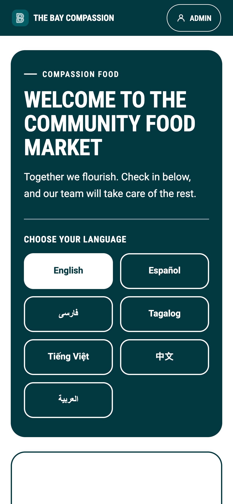
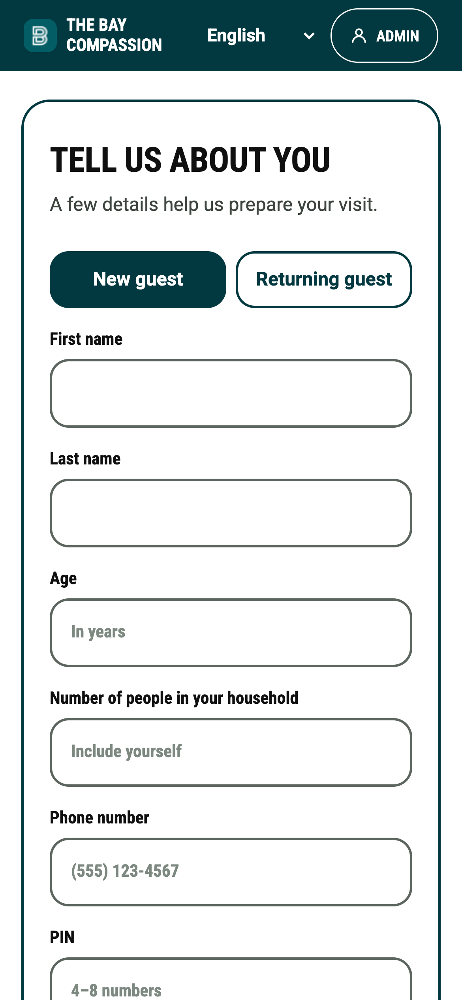
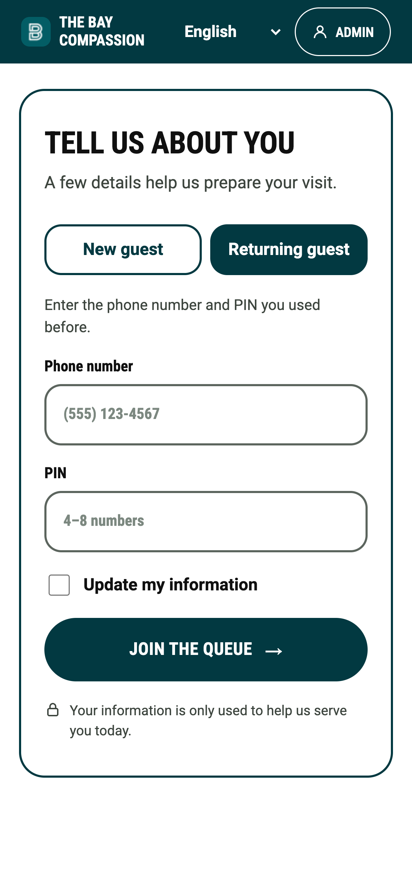
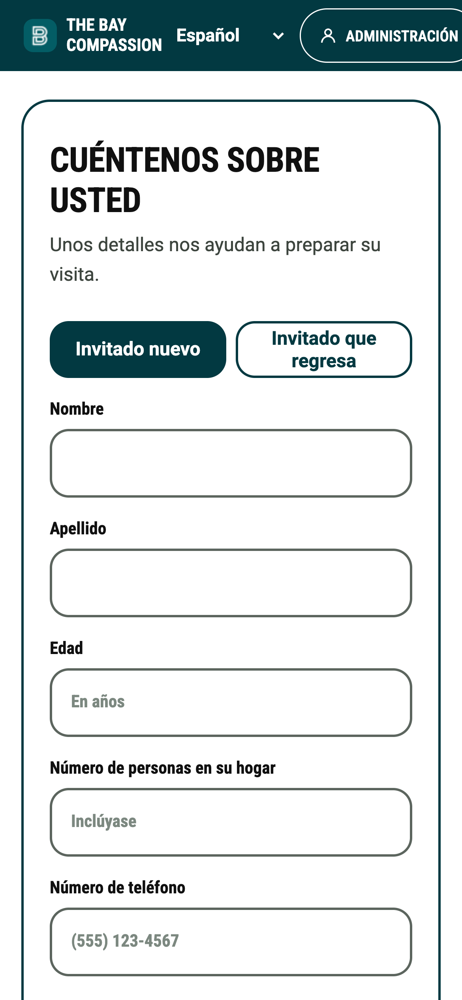
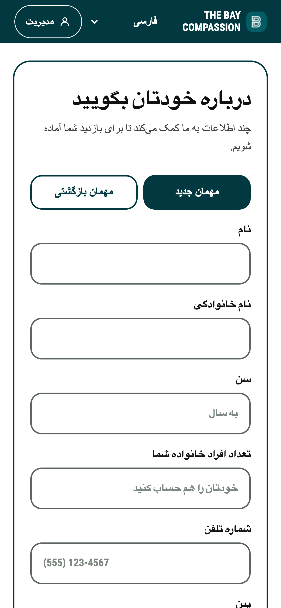
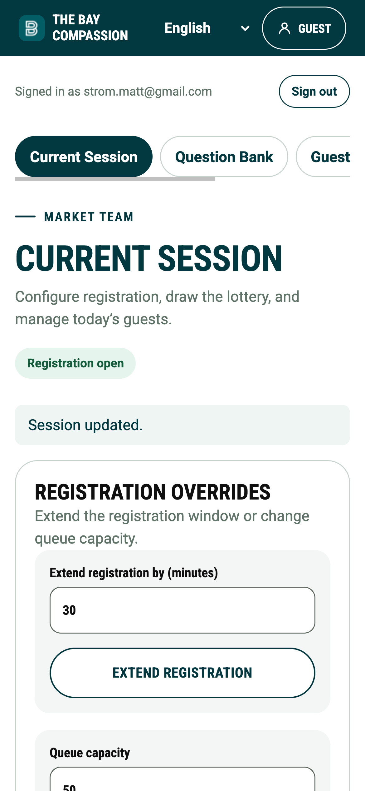
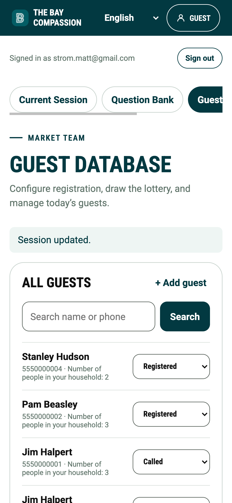
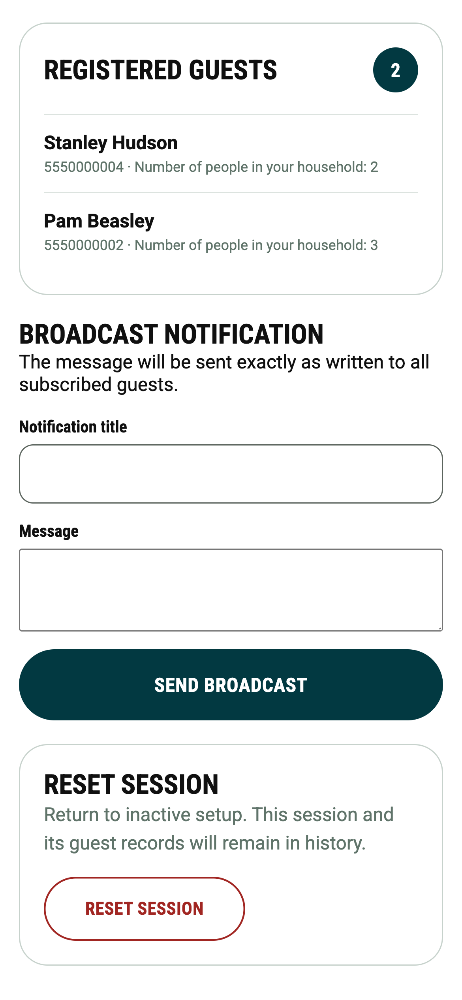

# The Bay Compassion

The Bay Compassion is a mobile-first check-in app for a community food market. Guests can choose their language, share the details needed for their visit, and join the queue. The app currently supports English, Spanish, Farsi, Tagalog, Vietnamese, Chinese, and Arabic. An early admin view is also available for future queue-management tools.

The frontend is a Vue 3 app in `src/`. Guest submissions are handled by a Netlify Function and stored with Netlify DB through Drizzle.

New to how apps like this are put together? Start with [`docs/concepts.md`](docs/concepts.md) —
a primer on frontend/backend/database, frameworks, secrets, and migrations, written for a
maintainer without a software background.

## Screenshots

### Guest check-in

<table>
  <tr>
    <td width="33%"></td>
    <td width="33%"></td>
    <td width="33%"></td>
  </tr>
  <tr>
    <td>Choose a language to begin.</td>
    <td>New guests share the details needed for their visit.</td>
    <td>Returning guests sign in with their phone number and PIN.</td>
  </tr>
  <tr>
    <td width="33%"></td>
    <td width="33%"></td>
    <td></td>
  </tr>
  <tr>
    <td>Every screen is translated — here in Spanish.</td>
    <td>Right-to-left languages such as Farsi flip the whole layout.</td>
    <td></td>
  </tr>
</table>

### Market team admin

<table>
  <tr>
    <td width="33%"></td>
    <td width="33%"></td>
    <td width="33%"></td>
  </tr>
  <tr>
    <td>Open registration, extend the window, and set queue capacity.</td>
    <td>Search guests and update their status.</td>
    <td>Send a broadcast notification, or reset the session.</td>
  </tr>
</table>

## Quickstart

### Prerequisites

- Node.js 24.15.0 (see `.nvmrc`)
- The [Netlify CLI](https://docs.netlify.com/cli/get-started/), signed in and linked to the Netlify site when you need to use functions or the database

### Run locally

```bash
npm install
npm start
```

`npm start` runs `netlify dev`, which serves the Vue app and Netlify Functions together. Follow the command output to open the local URL.

To work only on the frontend, you can also run:

```bash
npm run dev
```

This Vite server does not run the `/api/guests` Netlify Function.

## Checks

Run these commands from the repository root before opening a pull request:

```bash
npm run lint
npm run format:check
npm run test:unit -- --run
npm run build
```

See [`docs/testing.md`](docs/testing.md) for why the automated tests matter, especially if you're
relying on an AI coding agent to make changes.

## Deployment

The app is configured for Netlify in `netlify.toml`. Connect the repository to a Netlify site; Netlify builds the root app and publishes `dist`, while serving the functions in `netlify/functions/`.

Production can also be deployed manually from GitHub without building the app on a GitHub runner:

1. In Netlify, open **Project configuration → Build & deploy → Continuous deployment → Build
   hooks** and create a hook for the production branch.
2. Add the hook URL to the GitHub repository as an Actions secret named
   `NETLIFY_BUILD_HOOK`.
3. In GitHub, open **Actions → Deploy production → Run workflow**.

The workflow only triggers the hook. Netlify performs the build so its production environment
variables are available to Vite and the serverless functions.

Database migrations under `netlify/database/migrations/` apply automatically the moment a build
runs, including production builds — there is no separate manual step. Read
[`docs/migrations.md`](docs/migrations.md) before adding or changing a migration.

### Push notifications

Push notifications use standards-based Web Push with VAPID authentication. Generate the site's
long-lived key pair once:

```bash
npx web-push generate-vapid-keys
```

Add `VAPID_PUBLIC_KEY`, `VAPID_PRIVATE_KEY`, and `VAPID_SUBJECT` to the Netlify environment. The
subject must be a `mailto:` address or an HTTPS URL. Keep the private key secret and keep the same
key pair across deploys so existing browser subscriptions continue to work.

Set `NOTIFICATIONS_ENABLED=false` in the Netlify environment to hide notification opt-in, stop
queueing and delivering notifications, and make the scheduled function return without accessing
the database. Notifications remain enabled by default when the variable is unset.

The `notification-schedule` function runs once per minute on published deploys to close due
registration windows and deliver queued notifications. Scheduled functions do not run
automatically under `netlify dev`; invoke that function manually when testing locally.

## Auth0 administration access

The guest check-in is public. Auth0 protects the `/admin` route, guest records, and every
administrative API operation that changes market or guest data.

Configure Auth0 using [Netlify's Auth0 extension guide](https://docs.netlify.com/extend/install-and-use/setup-guides/auth0/):

1. Deploy and link this repository to a Netlify site.
2. As a Netlify Team Owner, install the **Auth0** extension from the team's Extensions page.
3. In the site's **Access & security** settings, link an Auth0 tenant and add it under **Site
   tenants**.
4. Create or choose both an Auth0 Single-Page Application and an Auth0 API. The API is required
   because the Netlify Functions validate access tokens using its audience.
5. In the Auth0 application's **API Access** tab, edit the Bay Compassion API and grant
   **User-delegated Access**. Without this grant, Auth0 rejects the SPA's audience request.
6. Choose the **Vite** environment-variable preset and assign the configuration to the desired
   deploy contexts. Confirm that Netlify created these values:
   - `VITE_AUTH0_DOMAIN`
   - `VITE_AUTH0_CLIENT_ID`
   - `VITE_AUTH0_AUDIENCE`
   - `VITE_AUTH0_ISSUER`

7. Redeploy the site so Vite can include its `VITE_` variables in the frontend build.

Netlify configures callback, logout, and web-origin URLs when the application is created through
the extension. If you select an existing Auth0 application instead, add the deployed site origin
and the local `netlify dev` origin to **Allowed Callback URLs**, **Allowed Logout URLs**, and
**Allowed Web Origins** in Auth0. Auth0 matches callback URLs exactly, so include the trailing `/`.

For local values not supplied by a linked Netlify site, copy `.env.example` to `.env` and replace
the placeholders. Do not commit `.env`.

Every Auth0 user who can sign in to this application has admin access. If the tenant also serves
non-admin users, configure Auth0 API permissions and roles before inviting them to this application.

## Project structure

- `src/` — Vue 3 frontend
- `public/` — static frontend assets
- `netlify/functions/` — API endpoints, including guest check-in
- `netlify/database/migrations/` — Netlify DB migrations; read [`docs/migrations.md`](docs/migrations.md)
  before changing anything here
- `db/` — Drizzle schema and database client
