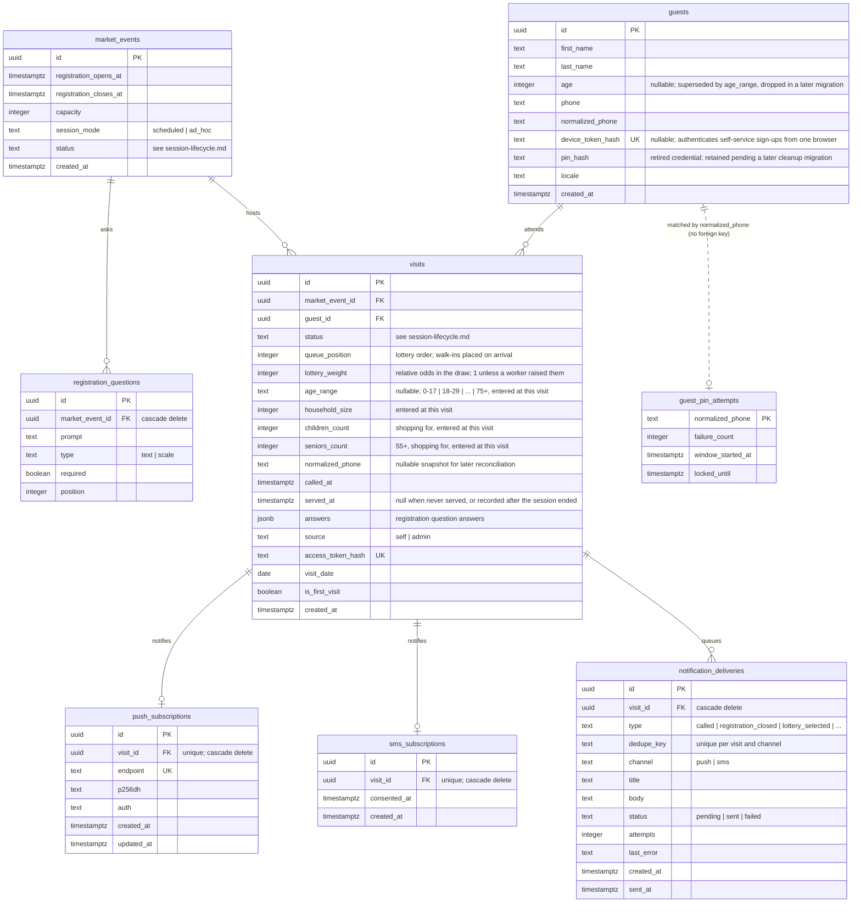

<!-- diagram-sources: db/schema.mts=e02861386e3a -->

# Database structure

A map of every table this app stores data in, and how they relate. The tables are defined in
[`../db/schema.mts`](../db/schema.mts); the migrations that created them are in
`netlify/database/migrations/` (see [`migrations.md`](migrations.md)).

The diagram is written in [Mermaid](https://mermaid.js.org/), a plain-text diagram format GitHub
renders automatically when viewing this file on github.com. It is maintained by hand — see
[keeping the diagrams honest](#keeping-the-diagrams-honest) at the bottom.

Companion diagrams: [`session-lifecycle.md`](session-lifecycle.md) for the states a market session
moves through, and [`user-journey.md`](user-journey.md) for the path a guest takes through the app.

A few things the diagram can't show on its own:

- **A `visit` is one guest at one market session.** It's the row that carries everything about that
  appearance — queue position, status, household composition, the answers given at registration —
  while `guests` holds only the long-lived identity reused across sessions: name, phone, and the
  device credential. Household composition (age range, household size, children/seniors counts)
  is entered fresh at each visit rather than carried on the guest, and the browser keeps its own
  last-entered copy in `localStorage` purely to prefill the next visit's form.
- **`guests` still has `age_range`, `household_size`, `children_count`, and `seniors_count`
  columns in the database that this diagram omits.** Application code stopped reading and writing
  them once household composition moved to `visits` — they're mid backfill-then-drop, waiting on a
  later migration to actually remove them (see
  [`migrations.md`](migrations.md#the-backfill-then-drop-rule)).
- **`called_at` and `served_at` are the only timing this database keeps.** There is no log of
  status changes, so anything time-based in reporting is measured from those two columns. Both are
  null for a visit a worker recorded after its session had already ended — that guest was handed
  food outside the app, and stamping a time would be inventing one.
- **The device token is the self-service guest credential.** The opaque token exists only in the
  browser; the database stores its hash in `device_token_hash`. Existing rows and guests added by
  an admin have no device credential. The retired `pin_hash` and `guest_pin_attempts` data remain
  only so removing them can happen in a separately reviewed, destructive migration.
- **`visits.normalized_phone` preserves the submitted phone number in normalized form.** Renewed
  information can update the long-lived guest profile without erasing the phone signal that was
  present on an earlier visit, so later analysis can reconcile possible duplicate guest records.
- **Only `market_events → registration_questions` and the two `visits →` tables cascade on delete.**
  `visits` itself has plain references, so a guest or market event with visits can't simply be
  deleted.

## Keeping the diagrams honest

Each diagram document starts with a `diagram-sources` comment listing the files it was drawn from
and a fingerprint of each. `npm run check:diagrams` recomputes those fingerprints and fails when one
has changed, so a schema edit can't quietly leave this page describing a database that no longer
exists. After reviewing (and fixing, if needed) the diagram, run
`npm run check:diagrams -- --update` to record that it was checked. `npm run checks` runs this
alongside the other pre-merge checks.
