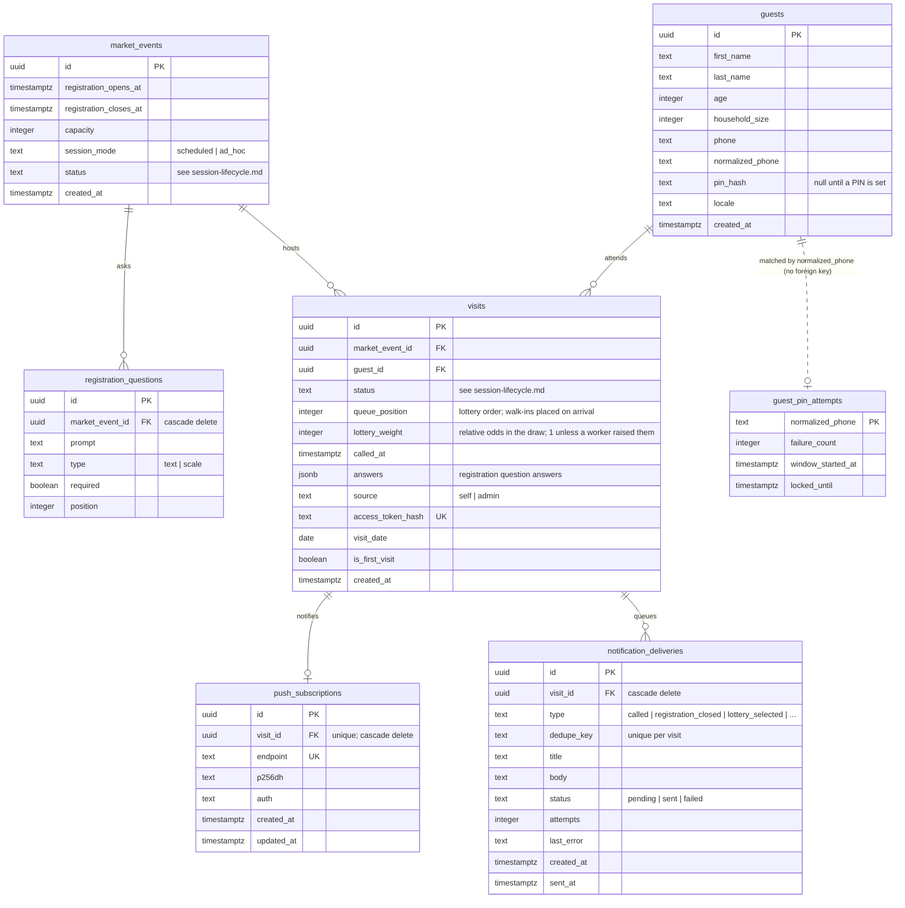

<!-- diagram-sources: db/schema.ts=eb711a98a39c -->

# Database structure

A map of every table this app stores data in, and how they relate. The tables are defined in
[`db/schema.ts`](../db/schema.ts); the migrations that created them are in
`netlify/database/migrations/` (see [`migrations.md`](migrations.md)).

The diagram is written in [Mermaid](https://mermaid.js.org/), a plain-text diagram format GitHub
renders automatically when viewing this file on github.com. It is maintained by hand — see
[keeping the diagrams honest](#keeping-the-diagrams-honest) at the bottom.

Companion diagrams: [`session-lifecycle.md`](session-lifecycle.md) for the states a market session
moves through, and [`user-journey.md`](user-journey.md) for the path a guest takes through the app.

A few things the diagram can't show on its own:

- **A `visit` is one guest at one market session.** It's the row that carries everything about that
  appearance — queue position, status, the answers given at registration — while `guests` holds only
  the long-lived person record reused across sessions.
- **`guest_pin_attempts` has no foreign key to `guests`.** It's keyed by phone number so failed PIN
  attempts can be rate-limited even when the phone number doesn't match any guest — which is exactly
  the case worth throttling.
- **Only `market_events → registration_questions` and the two `visits →` tables cascade on delete.**
  `visits` itself has plain references, so a guest or market event with visits can't simply be
  deleted.

## Keeping the diagrams honest

Each diagram document starts with a `diagram-sources` comment listing the files it was drawn from
and a fingerprint of each. `npm run check:diagrams` recomputes those fingerprints and fails when one
has changed, so a schema edit can't quietly leave this page describing a database that no longer
exists. After reviewing (and fixing, if needed) the diagram, run
`npm run check:diagrams -- --update` to record that it was checked. `npm run checks` runs this
alongside the other pre-merge checks.
