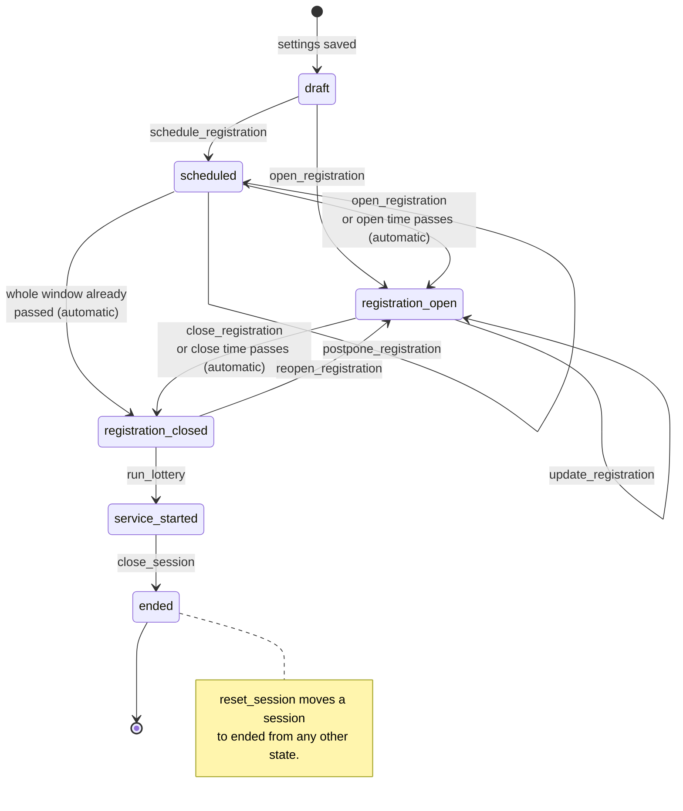
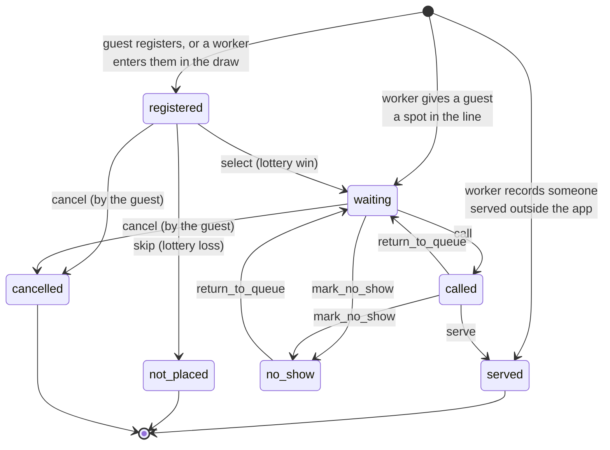

<!-- diagram-sources: src/services/sessionStateMachine.ts=38c5e443f733, netlify/services/marketSession.mts=644de638659d, src/services/visitStateMachine.ts=e7f9c6c319b9, netlify/services/visitQueue.mts=9ff110f41a51 -->

# Session lifecycle

A market session is one row in the `market_events` table. Its `status` column drives what the app
allows at any moment: whether guests can register, whether the lottery can run, whether the queue is
live. The allowed transitions are declared in
[`src/services/sessionStateMachine.ts`](../src/services/sessionStateMachine.ts) and enforced on the
server in [`netlify/services/marketSession.mts`](../netlify/services/marketSession.mts) — the browser
only ever offers the buttons; the backend decides whether a transition is legal.

The diagram is written in [Mermaid](https://mermaid.js.org/), a plain-text diagram format GitHub
renders automatically when viewing this file on github.com. It is maintained by hand — see
[keeping the diagrams honest](data-model.md#keeping-the-diagrams-honest).

Companion diagrams: [`data-model.md`](data-model.md) for the database tables, and
[`user-journey.md`](user-journey.md) for what a guest experiences while a session moves through
these states.

Transitions labelled with a command name are admin actions. Those marked _(automatic)_ happen on
their own once wall-clock time passes the session's registration window — `automaticSessionStatus`
is applied whenever the current session is read, so a session left alone still closes registration
on time.

Two commands change a session without changing its state: `postpone_registration` shifts a
scheduled window later, and `update_registration` extends the close time or capacity of an open one.
`schedule_registration` is only available to sessions in `scheduled` mode with an open time still in
the future; `ad_hoc` sessions are opened by hand straight from `draft`.

## What each state means

- **`draft`** — the session exists but nothing is public. This is the only state in which session
  settings (times, capacity, registration questions) can still be edited.
- **`scheduled`** — a future registration window is set and will open on its own when the time
  arrives.
- **`registration_open`** — guests can register. Each registration creates a `visits` row with
  status `registered`.
- **`registration_closed`** — registration is over and everyone waiting to hear back is holding a
  `registered` visit. Reaching this state queues a `registration_closed` notification for each of
  them.
- **`service_started`** — the lottery has run. Up to `capacity` visits become `waiting` with a
  `queue_position`; the rest become `not_placed`. Workers run the queue from here — see
  [the visit lifecycle](#the-visit-lifecycle) below.
- **`ended`** — the session is finished (or was reset) and is no longer the current session. Ended
  sessions appear in the admin history view. Closing a session also resolves every visit still
  `waiting` or `called` to `no_show`, in the same transaction as the transition, so ending a session
  never leaves a guest in a status that implies service is still coming.

The frontend collapses `draft` and `ended` into a single `inactive` state (`currentSessionState`),
because from a guest's point of view there is simply no session to join.

## The visit lifecycle

A session's status says what the market is doing; a **visit's** status says what is happening to one
guest. Each guest who registers gets one row in `visits`, and its `status` column moves through its
own small state machine, declared in
[`src/services/visitStateMachine.ts`](../src/services/visitStateMachine.ts) and enforced on the
server in [`netlify/services/visitQueue.mts`](../netlify/services/visitQueue.mts).

Only the transitions below are possible. The server rejects anything else with a `409`, so a
mis-tap cannot move a served guest back into the queue.

Who owns each transition matters:

- **The lottery** owns `select` and `skip`. `run_lottery` shuffles the `registered` visits, gives the
  first `capacity` of them a `queue_position`, and marks the rest `not_placed`. Any guest a worker
  already placed in the line is `waiting` before the draw runs, so those spots come out of
  `capacity` first and the winners are numbered behind them. The shuffle is weighted by each
  visit's `lottery_weight` (`weightedShuffle`): a visit weighted 2 is twice as likely as a 1 to
  land near the front, but nothing is guaranteed — every weight defaults to 1, which makes the
  draw a plain even shuffle unless a worker deliberately raised someone's odds.
- **The guest** owns `cancel`, from their own status screen, and only while `registered` or
  `waiting`.
- **A worker** owns `call`, `serve`, `mark_no_show`, and `return_to_queue`. These are the only four
  the admin UI ever offers, and it offers only the ones legal from a visit's current status.

Three of those also write a timestamp. `call` stamps `called_at`, which is what the queue screen
counts up from to show how long a guest has been standing at the table — the signal for deciding a
no-show. `serve` stamps `served_at`, which is what reporting measures service against; the pair is
the only timing the database keeps, since no log of status changes exists. `return_to_queue` is the
recovery path — a guest marked no-show who turns up after all, or one called by mistake, goes back
to `waiting` and is notified again when re-called — so it clears `called_at` on the way out.
Nothing transitions out of `served`, so `served_at` is only ever written once.

Workers call guests in batches. `call_next` on `/api/queue` takes the next N waiting guests in
queue order and calls them in a single statement, so two workers running the queue at the same time
cannot claim the same guest.

`queue_position` is display ordering, not an identifier — there is no unique constraint on it. A
guest a worker places in the line goes either at the front of the waiting guests (shifting them
down by one) or at the end, whether that happens during service or ahead of the draw.
