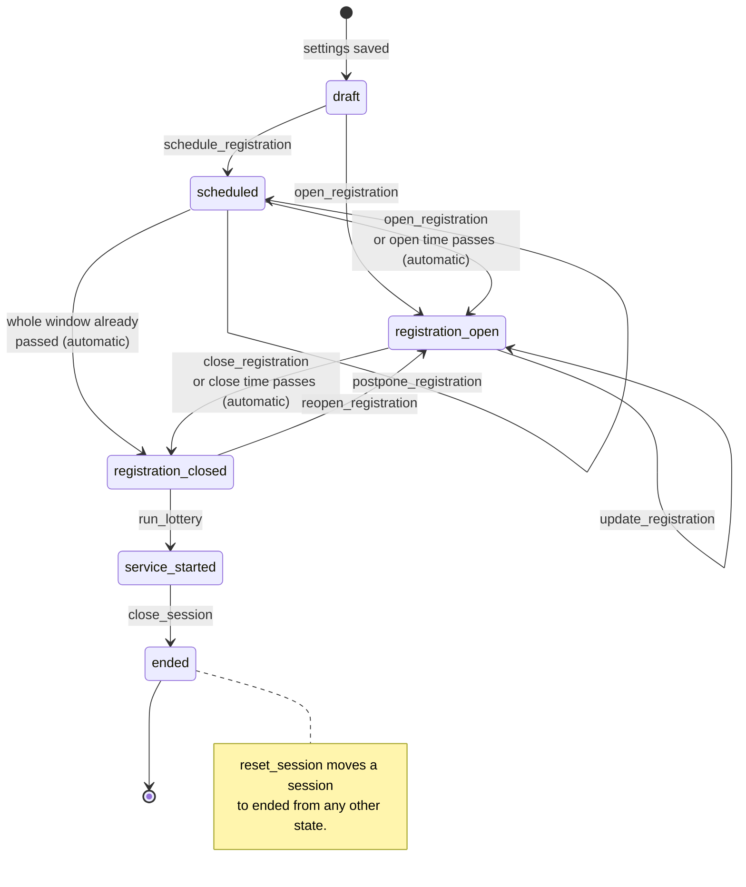

<!-- diagram-sources: src/services/sessionStateMachine.ts=4cb6eb595a61, netlify/services/marketSession.ts=265808ce579d -->

# Session lifecycle

A market session is one row in the `market_events` table. Its `status` column drives what the app
allows at any moment: whether guests can register, whether the lottery can run, whether the queue is
live. The allowed transitions are declared in
[`src/services/sessionStateMachine.ts`](../src/services/sessionStateMachine.ts) and enforced on the
server in [`netlify/services/marketSession.ts`](../netlify/services/marketSession.ts) — the browser
only ever offers the buttons; the backend decides whether a transition is legal.

The diagram is written in [Mermaid](https://mermaid.js.org/), a plain-text diagram format GitHub
renders automatically when viewing this file on github.com. It is maintained by hand — see
[keeping the diagrams honest](data-model.md#keeping-the-diagrams-honest).

Companion diagrams: [`data-model.md`](data-model.md) for the database tables, and
[`user-journey.md`](user-journey.md) for what a guest experiences while a session moves through
these states.

Transitions labelled with a command name are admin actions. Those marked _(automatic)_ happen on
their own once wall-clock time passes the session's registration window — `automaticSessionStatus`
is applied whenever the current session is read, so a session left alone still closes registration
on time.

Two commands change a session without changing its state: `postpone_registration` shifts a
scheduled window later, and `update_registration` extends the close time or capacity of an open one.
`schedule_registration` is only available to sessions in `scheduled` mode with an open time still in
the future; `ad_hoc` sessions are opened by hand straight from `draft`.

## What each state means

- **`draft`** — the session exists but nothing is public. This is the only state in which session
  settings (times, capacity, registration questions) can still be edited.
- **`scheduled`** — a future registration window is set and will open on its own when the time
  arrives.
- **`registration_open`** — guests can register. Each registration creates a `visits` row with
  status `registered`.
- **`registration_closed`** — registration is over and everyone waiting to hear back is holding a
  `registered` visit. Reaching this state queues a `registration_closed` notification for each of
  them.
- **`service_started`** — the lottery has run. Up to `capacity` visits become `waiting` with a
  `queue_position`; the rest become `not_placed`. Admins work the queue from here, moving visits to
  `called`, `served`, or `no_show`.
- **`ended`** — the session is finished (or was reset) and is no longer the current session. Ended
  sessions appear in the admin history view.

The frontend collapses `draft` and `ended` into a single `inactive` state (`currentSessionState`),
because from a guest's point of view there is simply no session to join.
