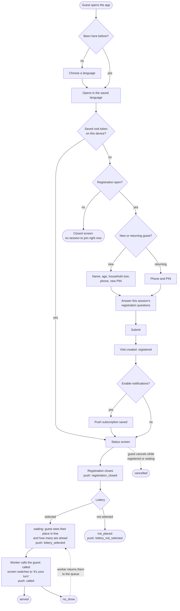

<!-- diagram-sources: src/App.vue=4aa03c2e0cdc, netlify/services/guestRegistration.ts=353c36828ec4, netlify/functions/visit.ts=dd21eb63d9e9 -->

# Guest journey

The path a guest takes from opening the app to being served, and the state their visit is in at each
step. The guest-facing screens are all in [`src/App.vue`](../src/App.vue); the endpoints they call
are `/api/market` (is registration open?), `/api/guests` (register), and `/api/visit` (check status,
cancel).

The diagram is written in [Mermaid](https://mermaid.js.org/), a plain-text diagram format GitHub
renders automatically when viewing this file on github.com. It is maintained by hand — see
[keeping the diagrams honest](data-model.md#keeping-the-diagrams-honest).

Companion diagrams: [`session-lifecycle.md`](session-lifecycle.md) for what the admin is doing
meanwhile, and [`data-model.md`](data-model.md) for where all of this is stored.

## Things worth knowing about this path

- **The visit token is the guest's login.** Registering stores a token on the device
  (`bay-compassion.visit-token` in local storage); every later status check and the cancel action
  authenticate with it. There is no guest account to sign into — clearing browser storage loses
  access to the visit.
- **A returning guest proves who they are with phone number plus PIN.** Repeated wrong PINs are
  rate-limited per phone number (`guest_pin_attempts`), and a returning guest can optionally update
  their stored profile while registering.
- **The status screen polls.** It re-checks `/api/visit` on a timer for as long as the visit is
  live — `registered`, `waiting`, or `called` — so the guest sees the lottery result and the call
  even without notifications. Push is a convenience, never the only channel. It also re-checks
  `/api/market`, so a guest sitting on the closed screen sees registration open without reloading.
- **A waiting guest is told where they stand.** `/api/visit` returns their `queue_position` and how
  many waiting guests are ahead of them, so they can judge whether to stay by the door or sit down.
  Once called, the whole card is replaced by an "it's your turn" panel rather than a changed status
  word — a guest glancing at their phone from across the room has to catch it.
- **An admin can register a walk-up guest directly.** Those visits are created with `source: admin`
  and skip straight to `waiting` — they bypass the lottery entirely rather than starting at
  `registered`. The worker chooses whether they go to the front of the waiting guests or the end.
- **Notifications are best-effort.** Push requires a browser that supports it, and on iOS the app
  must be installed to the home screen first. Admins can also send a broadcast message to everyone
  in the session whose visit isn't cancelled.
- **Cancelling is only possible before service.** The cancel button appears only while the visit is
  `registered` or `waiting`, and not at all once the session has ended.
- **A closing session resolves anyone left over.** Ending a session marks every visit still
  `waiting` or `called` as `no_show`, so nobody is left holding a status that implies service is
  still coming. See [`session-lifecycle.md`](session-lifecycle.md#the-visit-lifecycle) for the full
  set of visit transitions.
