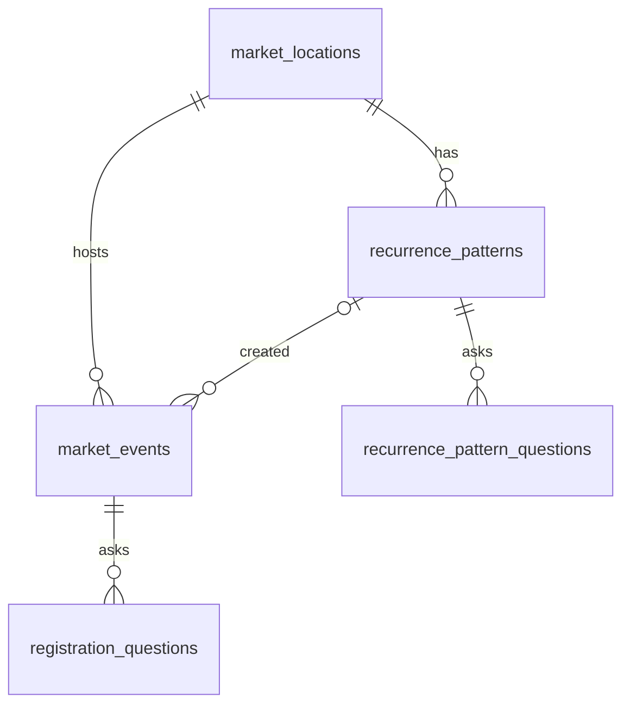
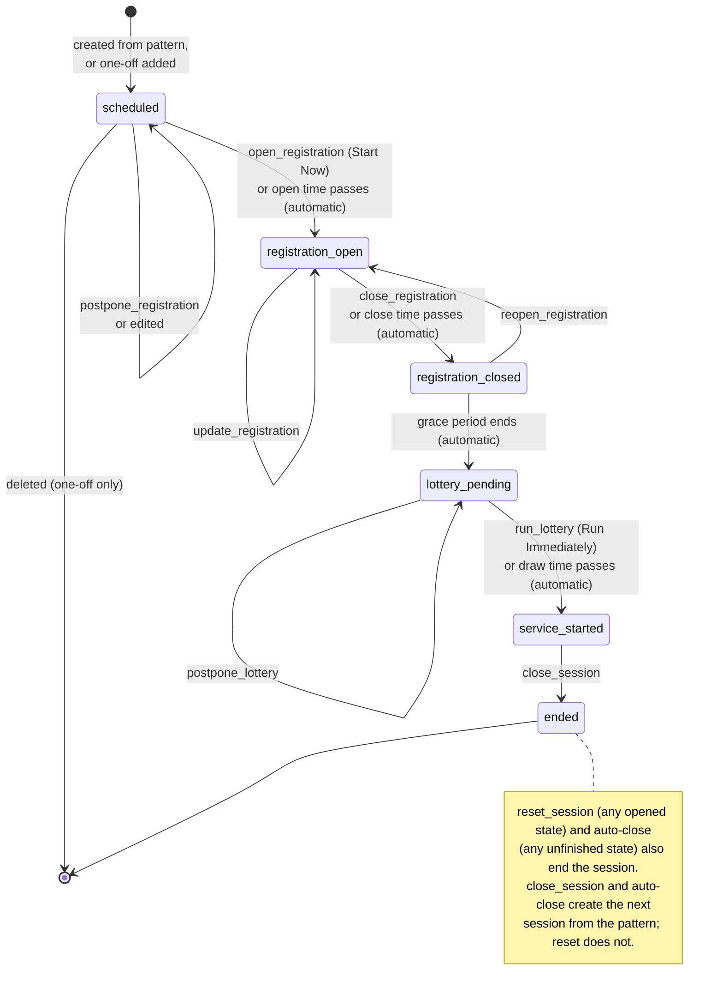

# Admin scheduling — requirements and design

**Intent:** [`intent.md`](intent.md) (approved in [#137](https://github.com/bay-compassion/food-market-app/pull/137)) · **Stage:** 2 — Requirements and design ·
**Status:** Product owner decisions recorded; awaiting sign-off

This spec turns the approved intent into something the engineering team can plan against. Where it
answers one of the intent's open questions, the answer is marked **Proposed** so the product owner
can confirm or overrule it. [Flagged concerns](#flagged-concerns) records what needed a decision
before Build and how each was decided.

## Answers to the intent's open questions

| #   | Intent question                        | Proposed answer                                                                                                                                                                                                                                                                                                                                                                    |
| --- | -------------------------------------- | ---------------------------------------------------------------------------------------------------------------------------------------------------------------------------------------------------------------------------------------------------------------------------------------------------------------------------------------------------------------------------------- |
| 1   | Auto-close counts from what?           | From the session's **actual** registration open time. Start Now moves that time to the moment staff press it, so auto-close moves with it. Counting from the originally scheduled time would give a session started a day early an auto-close time in the past.                                                                                                                    |
| 2   | Auto-closing before the lottery ran    | Decided: however a session ends — Close Session, auto-close, or reset — every guest still in line (`registered`, `waiting`, or `called`) is resolved to `cancelled`, with no notification. `no_show` is recorded only when a worker marks a guest as one, because a high `no_show` count will later count against a guest. See [C4](#c4-guests-still-in-line-when-a-session-ends). |
| 3   | Delete on the pattern row              | Deletes the pattern and its Pending session, if that session hasn't opened yet. A session that is already active keeps running; when it ends, no next session is created. Ended sessions keep their data and simply stop pointing at the pattern.                                                                                                                                  |
| 4   | One-off sessions alongside the pattern | Adding a one-off session **replaces** the pattern's Pending session. When the one-off session ends, the pattern creates its next session as usual. Adding one is blocked while a session is active or another one-off session is pending. Decided: one-off sessions are a real use, available in production ([C8](#c8-one-off-sessions-in-production)).                            |
| 5   | Editing the Pending session            | Allowed while it is still Pending: times, capacity, lottery delay, auto-close, and questions. Editing the pattern regenerates a Pattern-created Pending session from scratch, discarding those edits, and the UI asks before doing so.                                                                                                                                             |
| 6   | The Session tab                        | Keeps steering the live session: phase controls, registration overrides, broadcast. It loses the settings form and session-mode selector — creating and editing sessions moves to the Schedule tab. The Question bank tab edits the pattern's questions.                                                                                                                           |
| 7   | Grid on a phone                        | Below 600px wide, the grid shows three columns — Date (with times as a second line), Status, and Actions — and row actions move into an overflow menu.                                                                                                                                                                                                                             |

## Requirements

### Locations

- **R1.** A market location has a name and an IANA time zone. The migration seeds exactly one: _The
  Bay Church_, Concord, CA, `America/Los_Angeles`.
- **R2.** Every session and every pattern belongs to a location. Nothing in the UI lets staff pick
  one; all operations use the single seeded location.
- **R3.** All local dates and times — pattern times, which weekday a date falls on, calendar days,
  and every time displayed or entered on the Schedule tab — are read in the location's time zone,
  not the device's, and respect daylight saving time.

### Recurrence pattern

- **R4.** A pattern holds: a start date, a local registration open time, a registration duration
  (default 60 minutes), capacity, an optional lottery delay in minutes (default empty — a manual
  draw; see [C3](#c3-an-automated-lottery-is-irreversible-and-notifies-guests-unattended)), an
  optional auto-close time in minutes after registration opens (default 720), and an ordered list
  of registration questions.
- **R5.** A pattern occurs weekly on the weekday of its start date, from that date onward, until it
  is deleted.
- **R6.** At most one pattern exists per location. Creating a second one is rejected.
- **R7.** Validation: duration 1–1440 minutes; capacity 1–10,000 (matching the existing
  `market_events_capacity_check`); lottery delay empty or 0–120 minutes; auto-close empty or later
  than registration close plus the lottery delay.

### Session lifecycle

- **R8.** `draft` and the `ad_hoc` session mode no longer exist. A session is created directly as
  `scheduled`, which the grid labels **Pending**.
- **R9.** At most one unfinished session (any status other than `ended`) exists per location. The
  database enforces this, not only application code.
- **R10.** A pattern creates its next session when:
  1. a session ends by Close Session or auto-close — **not** by reset;
  2. a pattern is created or edited and the location has no unfinished session;
  3. a pattern is edited — its Pending session is replaced;
  4. a Pending one-off session is deleted;
  5. staff press **Create next session** on the pattern row (R28), which is how the schedule resumes
     after a reset.

  Nothing creates a session as a side effect of reading one. A reset leaves the location with no
  session on purpose, and reading must not quietly undo that.

- **R11.** The next session is the pattern's earliest occurrence whose registration open time is
  after the moment it is created. This is what recreates the same week's session after Start Now:
  a Saturday session started on Friday and closed on Friday produces that Saturday again.
- **R12.** A new session copies the pattern's settings and questions. Later pattern edits do not
  reach sessions that have already opened.
- **R13.** **Start Now** is the existing `open_registration` command on the Pending session. It
  moves registration open to now and keeps the registration duration (`openingWindow` already does
  this). The lottery delay and auto-close, being relative, move with it.
- **R14.** Pending sessions cannot be reset. A Pending one-off session can be deleted if it has no
  visits; a Pattern-created Pending session cannot be deleted on its own (skipping a date is out of
  scope).

### Scheduled lottery

- **R15.** When a session has a lottery delay, the lottery draws automatically at
  `grace deadline + delay`, where the grace deadline is the existing registration close plus 30
  seconds. It sends the same selected and not-selected notifications as a manual draw.
- **R16.** With no delay, the lottery is drawn by hand, as today.
- **R17.** **Run Immediately** is the existing `run_lottery` command.
- **R18.** **Postpone** is a new `postpone_lottery` command, available in `lottery_pending` when the
  session has a delay. It takes 1–10 minutes and adds them to the delay.

### Auto-close

- **R19.** When a session has an auto-close time, it ends automatically at
  `registration opens + auto-close minutes` if it has not ended already.
- **R20.** Ending a session runs one shared transaction: status becomes `ended`, and every guest
  still in line — `registered`, `waiting`, or `called` — becomes `cancelled`, with no notification.
  Whether the next session is created depends on how it ended:

  | Ended by      | Next session created |
  | ------------- | -------------------- |
  | Close Session | yes                  |
  | Auto-close    | yes                  |
  | Reset         | no                   |

  A guest left in line when the market ends didn't miss their turn, so ending a session never
  records a `no_show`; only a worker's `mark_no_show` does. This replaces today's behavior, where
  Close Session resolves `waiting` and `called` guests to `no_show`. It also adds
  `called → cancelled` to the visit lifecycle, applied only by the server when a session ends;
  guests still cancel only from `registered` or `waiting`.

- **R21.** A registration override (`update_registration`) cannot move registration close past the
  auto-close time.

### Schedule tab

- **R22.** A new admin view, `schedule`, requires `manage:sessions` and appears in the navigation
  after the Session tab. Admin text is not localized.
- **R23.** A month calendar (MUI `DateCalendar`) shows a filled pip on the date of each unfinished
  session and a hollow pip on each future date the pattern covers after its Pending session.
  Pattern dates are calculated for the visible month only, without creating sessions. Ended
  sessions get no pip.
- **R24.** A grid (MUI DataGrid, MIT) lists only what hasn't finished: the pattern row first, then
  any unfinished session — in practice at most one. Ended sessions belong to the Session History
  tab and do not appear. Column sorting is turned off. Columns: Date, Registration (open–close),
  Lottery (draw time, or "Manual"), Status, Actions.
- **R25.** The pattern row shows "Every Saturday · from Sep 19, 2026" in Date, local times in
  Registration, the delay in Lottery ("15 min after close" or "Manual"), and **Recurring** as its
  status.
- **R26.** Statuses: **Recurring** (pattern row), **Pending** (`scheduled`), and **Active**
  (`registration_open` through `service_started`).
- **R27.** Clicking a calendar date filters the grid to that date and selects its row. A chip reads
  "Showing Sat, Sep 26" with a clear button. A date only the pattern covers shows and selects the
  pattern row. A date with nothing shows an empty state.
- **R28.** Row actions:
  - **Recurring:** Edit, Delete, and **Create next session** while the location has no unfinished
    session.
  - **Pending:** Start Now, Edit, and Delete for one-off sessions only.
  - **Active:** Go to session, which opens the Session tab.
- **R29.** Grid toolbar actions: **Add recurring pattern**, disabled while a pattern exists, and
  **Add one-off session**, disabled with an explanation while a session is active or a one-off
  session is pending.
- **R30.** Every destructive or guest-visible action — Delete, Start Now, Create next session, and a
  pattern edit that replaces a Pending session — asks for confirmation through the existing
  `ConfirmationStore`.
- **R31.** Below 600px wide, the grid follows the phone layout in answer 7.

## Design

### Data model

**`market_locations`** (new): `id` uuid, `name` text, `time_zone` text (IANA), `created_at`. The
seed row uses a fixed UUID so the migration can backfill by an explicit key, as
[`docs/migrations.md`](../../docs/migrations.md) asks.

**`recurrence_patterns`** (new): `id`, `location_id` → locations, `starts_on` date,
`registration_opens_at` time (local wall clock, no zone), `registration_duration_minutes` int,
`capacity` int, `lottery_delay_minutes` int null, `auto_close_after_minutes` int null,
`created_at`, `updated_at`. A unique index on `location_id` enforces R6; dropping that index is
the whole schema change for multiple patterns later.

**`recurrence_pattern_questions`** (new): same shape as `registration_questions`, keyed to a pattern,
cascading on delete.

**`market_events`** changes:

- add `location_id` → locations, not null (backfilled to the seed row);
- add `recurrence_pattern_id` → patterns, null, `ON DELETE SET NULL`; null means a one-off session;
- add `lottery_delay_minutes` int null and `auto_close_after_minutes` int null;
- change the `status` default from `'draft'` to `'scheduled'`;
- drop `session_mode`;
- add a partial unique index on `location_id` where `status <> 'ended'` (R9).

Lottery delay and auto-close are stored as **offsets**, not timestamps. The times they're measured
from still move — Start Now and `postpone_registration` move registration open, and
`reopen_registration` moves close — so storing instants would mean recomputing them on every one
of those paths. The draw and close times are derived instead (see below). Postpone just increments
the offset.

### Domain classes (`src/services/`)

Plain TypeScript, with no MobX, React, or DOM, because the server uses them too. Each is built from
state, per `CLAUDE.md`.

- **`RecurrencePattern`** — built from a pattern row and its location's time zone.
  - `weekday`, `occurrencesBetween(from, to): LocalDate[]` for pips;
  - `nextOccurrence(after: Date)` for R11;
  - `sessionFor(occurrence)` returning the values for a new `market_events` row;
  - `description` for R25.
- **`SessionTimeline`** — built from a session row.
  - `lotteryDrawsAt: Date | null` = grace deadline + delay;
  - `autoClosesAt: Date | null` = registration opens + auto-close;
  - `dueTimers(now)` telling a handler which automatic step is due.
  - It absorbs the timing half of today's `automaticSessionStatus`, `openingWindow`, and
    `postponedWindow` — the first-parameter functions `CLAUDE.md` says to convert.
- **`ScheduleRow`** — the display value for one grid row, built from a pattern or a session. It owns
  the status label (R26) and which actions apply (R28).

### Session lifecycle

Removed: `draft`, `schedule_registration`, and every `sessionMode` branch. The
`schedule_registration` guard, the `ad_hoc` branch of `openingWindow`, and the `draft` check in
`saveSettings` all go.

**Ending a session** is one server function, used by `close_session`, `reset_session`, and the
auto-close timer. It takes how the session ended and runs R20 in a single transaction, locking the
session row the same way `runLottery` does. Today `reset_session` resolves no visits at all, which
leaves guests in a status that implies service is still coming; routing it through the shared
function fixes that.

**Creating the next session** runs inside the same transaction as whatever triggered it. It inserts
the row and copies the questions. If the partial unique index rejects the insert because another
unfinished session exists, that is treated as "nothing to do", not an error.

### Background timing

Timed transitions keep using Netlify Async Workloads with `delayUntil`, the mechanism
`market-registration-close.mts` already uses. A cron-scheduled sweeper is deliberately **not**
used: polling the database every minute would keep Netlify DB (Neon) from ever scaling to zero.

- **One workload, `market-session-timer`, replaces `market-registration-close`.** Its event carries
  `{ marketEventId, timer: 'registration_close' | 'lottery_draw' | 'auto_close', expectedAt }`.
- **The handler does nothing** if the session no longer exists, if its status makes the timer
  meaningless, or if the timer's current derived time no longer equals `expectedAt` — meaning
  something moved it and a newer event is on the way.
- **It re-arms if woken early.** If `now < expectedAt`, the handler sends itself again with
  `delayUntil = min(expectedAt, now + 6 days)`. Netlify's documentation does not clearly state a
  maximum delay (see [concern C6](#c6-async-workload-delay-limit)). Re-arming makes that irrelevant,
  even though a new session's auto-close can be about 7½ days away when it's created.
- **When timers are scheduled:**

  | Timer                | Sent when                                                                                                                                       |
  | -------------------- | ----------------------------------------------------------------------------------------------------------------------------------------------- |
  | `registration_close` | session created or edited; `open_registration`; `postpone_registration`; `update_registration`; `reopen_registration` (as today, plus creation) |
  | `auto_close`         | session created or edited; `open_registration`; `postpone_registration`                                                                         |
  | `lottery_draw`       | the session reaches `registration_closed` or `lottery_pending` (lazily or through `close_registration`); `postpone_lottery`                     |

- **Auto-close is also applied when the current session is read**, like the existing automatic
  transitions, so a lost timer heals the next time anyone opens the app. (This ends an overdue
  session; it never creates one where none exists — see R10.)
- **The lottery draw is not applied on read.** It is irreversible and notifies every registered
  guest, so it runs only from the timer or from a staff member's press — never as a side effect of a
  guest's `GET /api/market`. If its timer is lost, staff still see **Run Immediately**.

### API

All new routes live under `/api/admin`, require `manage:sessions`, and return the full schedule
payload so the store can replace its state in one step.

| Method and path                                 | Purpose                                                                                                 |
| ----------------------------------------------- | ------------------------------------------------------------------------------------------------------- |
| `GET /api/admin/schedule`                       | `{ location, pattern \| null, sessions }` — unfinished sessions only, with derived draw and close times |
| `PUT /api/admin/schedule/pattern`               | Create or replace the pattern and its questions; regenerate the Pending session (R10.3)                 |
| `DELETE /api/admin/schedule/pattern`            | Delete the pattern and its Pending session (answer 3)                                                   |
| `POST /api/admin/schedule/pattern/next-session` | Create the next session from the pattern (R10.5); 409 while an unfinished session exists                |
| `POST /api/admin/schedule/sessions`             | Add a one-off session (answer 4)                                                                        |
| `PATCH /api/admin/schedule/sessions/:id`        | Edit a Pending session (answer 5); 409 once it has opened                                               |
| `DELETE /api/admin/schedule/sessions/:id`       | Delete a Pending one-off session with no visits; 409 otherwise                                          |

Start Now, Run Immediately, and Postpone go through the existing `POST /api/admin/market` action
route (`open_registration`, `run_lottery`, and the new `postpone_lottery`). `PUT /api/admin/market`
(`saveSettings`) is removed. Pattern and session payloads carry **local** date and time strings; the
server resolves them against the location's time zone, so a phone in another time zone cannot shift
a market by an hour.

### Admin UI

- **`ScheduleStore`** on `RootStore`: loads the payload; holds `visibleMonth` and `selectedDate`.
  Computed values build `RecurrencePattern`, `ScheduleRow[]`, pip dates, and the filtered rows;
  actions call the API. No component receives the schedule through props — each reads the store
  inside `observer()`.
- **Components** in `src/components/schedule/`, each well under the 250-line guideline:
  - `ScheduleView` (the tab);
  - `ScheduleCalendar` (the `DateCalendar` with a custom `day` slot for pips);
  - `ScheduleGrid` with `schedule-columns.tsx`;
  - `ScheduleStatusChip`;
  - `RecurrencePatternDialog` and `SessionDialog`, sharing a `SessionTemplateFields` form section
    and the existing question editor.
- **Stories** use `parameters: { shell: 'admin' }` and cover: no pattern; pattern with a Pending
  session; pattern with no session after a reset; an active session; a pattern-only date; the phone
  width; and a confirmation `play` test.
- **Dependencies:**
  - `@mui/x-date-pickers` (MIT), matching the installed MUI v9 line;
  - a date library that handles IANA time zones in both the browser and Node, and has an MUI
    adapter that supports the pickers' `timezone` prop. Day.js (with its `utc` and `timezone`
    plugins) and Luxon both qualify; date-fns's adapter does not support that prop. The choice is
    left to Build.
  - Both load only in the lazily routed admin chunk and on the server — never in the guest chunk.
- **Retired:** `SessionSettingsForm`'s mode selector and settings form; `SessionSettings.sessionMode`
  and `adHocClosesAt`; the `ad_hoc` strings in `adminLocales.ts`.

### Time zones and DST

- The database keeps instants in `timestamptz`, as today.
- A pattern's date and time become an instant through the location's time zone at the moment a
  session is created.
- A local time that doesn't exist (the spring-forward gap) moves forward by the gap. An ambiguous
  one (fall-back) takes the earlier offset.
- A 9–11 AM market never hits either case, but the rule is specified and unit tested:
  - a Sunday pattern straddling 2026-11-01 (fall back);
  - a Sunday pattern straddling 2027-03-14 (spring forward);
  - a 01:30 pattern on the fall-back date;
  - a 02:30 pattern on the spring-forward date.

### Also affected

- **`docs/session-lifecycle.md` and `docs/data-model.md`:** diagrams redrawn and re-stamped with
  `check:diagrams` after review. The visit lifecycle gains `called → cancelled` for ended sessions,
  and its prose stops describing `cancel` as guest-only.
- **`src/services/visitStateMachine.ts`** and `resolveOutstandingVisits` in
  `netlify/services/visitQueue.mts`: the resolved status changes from `no_show` to `cancelled`, and
  `registered` joins the statuses it resolves. `docs/session-lifecycle.md` currently says closing a
  session resolves guests to `no_show`; that prose changes too, as do the `closeSession` tests.
- **Reports:** a `cancelled` visit no longer always means the guest cancelled. Reports that treat
  cancellations as a guest choice should be checked in Build.
- **Demo data:** `netlify/services/demoScenario.mts`, `scripts/fake-data.mts`, and their tests stop
  writing `session_mode` and `draft`. Demo sessions get the seeded location.
- **Existing tests and stories** that construct `draft` or `ad_hoc` sessions are updated —
  `sessionStateMachine.test.ts`, `marketSession.test.mts`, `session-settings.test.ts`,
  `SessionView.stories.tsx`, and others found by grepping for `sessionMode`.

## Flagged concerns

Each concern was reviewed by the product owner; the decision is recorded with it.

### C1. Pinning the pattern row needs a paid DataGrid plan

The intent says the pattern row is pinned to the top. DataGrid's `pinnedRows` is a **Pro** feature,
and this project uses the MIT grid.

**Decided:** the store puts the pattern row first and column sorting is turned off
(`disableColumnSorting`). Since the grid now shows only unfinished sessions (R24), it holds two rows
at most, so neither sorting nor sticky pinning adds anything.

### C2. The migration is destructive

It drops `market_events.session_mode`, and something has to happen to any existing `draft` rows. A
`draft` row would also keep the new partial unique index from being created if another unfinished
row exists.

The plan is to purge session data before this lands. The migration still must not depend on that:

- it ends any remaining `draft` rows (`UPDATE … SET status = 'ended' WHERE status = 'draft'`)
  rather than deleting them;
- it backfills `location_id` using the seed row's fixed UUID.

Under `docs/migrations.md`, the drop and the data-mutating update both need explicit owner sign-off
and a deploy-preview dry run, and the drop would normally wait for a later deploy.

**Decided:** the owner signed off on shipping it as a **single deploy**, since no production data is
being kept. The deploy-preview dry run and a human merge are still required.

### C3. An automated lottery is irreversible and notifies guests unattended

A draw that fires on a timer sends selected and not-selected notifications with nobody from staff
necessarily watching.

**Decided:** the lottery delay defaults to **empty**, so every session draws by hand unless staff
set a delay. The plumbing is still built in full — the delay column, the `lottery_draw` timer,
`postpone_lottery`, and the delay field in the pattern and session dialogs — because a stakeholder
considers the automated draw important, and turning it on should need no further engineering.

### C4. Guests still in line when a session ends

When a session ends, some guests may still be `registered`, `waiting`, or `called` — after a reset
or auto-close, or simply because the day ended before they were called. Today Close Session records
`waiting` and `called` guests as `no_show`, which would count against them later although they
didn't miss their turn.

**Decided:** every ending — Close Session, auto-close, and reset — resolves all three to `cancelled`,
without notification (R20). `no_show` comes only from a worker marking a guest.

### C5. The guest-facing schedule text is hard-coded

`guestView.scheduleInformation` says "Registration opens every Saturday at 10:30 AM" in every
locale. It will drift the moment the pattern changes.

**Decided:** postponed to a follow-up intent. Deriving the text needs locale-aware weekday and time
formatting in seven languages, a guest-facing change beyond this intent.

### C6. Async Workload delay limit

The Netlify pages consulted don't clearly state a maximum `delayUntil`; one source mentions a
one-week cap on retry backoff. The re-arm design above works either way.

**Decided:** Build confirms the limit on a deploy preview rather than assuming it.

### C7. The Session tab still uses the device's time zone

`toLocalDateTimeInput` and the registration-override inputs use the phone's time zone. The Schedule
tab uses the location's. On a phone set to Pacific Time they agree; a worker whose phone is in
another time zone would see different times on the two tabs.

**Decided:** accepted for now, since everyone runs the market on site. Moving the Session tab to
location time is a follow-up.

### C8. One-off sessions in production

The intent calls one-off sessions mostly a development aid, but a special market — a holiday
distribution, say — is a real use.

**Decided:** one-off sessions are a real feature, available in production to anyone with
`manage:sessions`, with no deploy flag.

## Suggested build order

These are dependent pull requests, as a stack, for Stage 3 plan mode to refine:

1. **Schema and domain:**
   - the migration;
   - Drizzle schema;
   - `RecurrencePattern` and `SessionTimeline`, with DST unit tests.
2. **Lifecycle:**
   - retire `draft` and `ad_hoc`;
   - the shared end-session transaction, resolving guests still in line to `cancelled`;
   - next-session creation;
   - `postpone_lottery`;
   - the `market-session-timer` workload;
   - lifecycle docs and diagrams.
3. **Schedule API:** the new routes and payload, with handler tests in `netlify/test/functions/`.
4. **Schedule tab:**
   - `ScheduleStore`, calendar, grid, and dialogs;
   - stories;
   - navigation entry.
5. **Cleanup:**
   - retire the settings form and mode selector;
   - point the Question bank at the pattern;
   - update demo data.

## Out of scope

- Skipping or editing a single occurrence (from the intent).
- Multiple locations or patterns in the UI. The schema allows them later by dropping one unique
  index.
- Deriving the guest-facing schedule text from the pattern (C5).
- Moving the Session tab to location time (C7).
